# HƯỚNG DẪN SỬ DỤNG BIA XY STUDIO

## Sổ tay website, tay cầm và bia di động XY

Tác giả: Trần Nguyên Bình  
Phiên bản tài liệu: 1.1 · Có ảnh thao tác · Ngày 03/10/2026

Website: https://nguyenbinh-shark.github.io/bia-xy-studio/

Tài liệu dành cho người vận hành hệ thống: mở website, kết nối tay cầm, ghép bia, tạo bài tập, chạy một hoặc nhiều bia và sao lưu dữ liệu. Tên nút trong tài liệu giữ theo giao diện tiếng Việt hiện tại.

**Cách đọc ảnh:** ảnh thao tác chụp từ giao diện đang chạy; các màn hình tay cầm dùng chế độ Dùng thử. Khung màu cam và số 1, 2, 3 đánh dấu nút/ô cần thao tác. Bấm ảnh trong bản web để mở kích thước đầy đủ. Ảnh mô phỏng không xác nhận đã kết nối phần cứng hoặc đã nạp bài cloud.

**Phạm vi phiên bản:** USB, mô phỏng, thiết kế bài và điều khiển bia qua ESP-NOW đã có trong mã nguồn được đối chiếu. Website có thư viện cloud và màn hình Đồng bộ; firmware tay cầm hiện tại chưa có chức năng kết nối Internet, tạo mã ghép cloud hoặc tải bài qua WiFi. Vì vậy, chuyển bài xuống tay cầm bằng USB là quy trình sử dụng hiện tại. Chương 8 mô tả điều kiện của đồng bộ cloud để người dùng nhận biết đúng khả năng thiết bị.

Tài liệu mô tả thao tác phần mềm và vận hành cơ cấu bia. Kết quả mô phỏng không thay thế kiểm tra trên thiết bị đã lắp thực tế. Hệ thống hiện không có cảm biến ghi nhận phát trúng và không tự chấm điểm bài tập.

## Mục lục

- 1. Nhận biết hệ thống và các kết nối
- 2. Chuẩn bị và sử dụng lần đầu
- 3. Kết nối website với tay cầm qua USB
- 4. Ghép và quản lý bia
- 5. Tạo bài tập trên website
- 6. Ba bài mẫu thực hành
- 7. Điều khiển và chạy bài trên bia
- 8. Tài khoản, cloud và đồng bộ
- 9. Sao lưu và chuyển bài bằng file
- 10. Cài đặt và hiệu chuẩn
- 11. Xử lý sự cố
- 12. Phiếu kiểm tra, bàn giao và nhật ký
- Phụ lục A. Giới hạn và đơn vị
- Phụ lục B. Thuật ngữ và file bài mẫu

## 1. Nhận biết hệ thống và các kết nối

### 1.1. Ba thành phần chính

**Website Bia XY Studio** chạy trong trình duyệt. Website có bản sao màn hình tay cầm, bộ thiết kế bài tập và nơi quản lý bài lưu trên tài khoản. Có thể soạn bài và xem mô phỏng trước khi dùng thiết bị thật.

**Tay cầm** là bộ điều khiển có màn hình cảm ứng. Tay cầm lưu danh sách bia, cài đặt và bài tự tạo; gửi lệnh đến bia bằng ESP-NOW. Sau khi đã nạp bài, có thể vận hành trực tiếp từ tay cầm mà không cần giữ máy tính kết nối.

**Bia XY** là cơ cấu chuyển động mục tiêu trong mặt phẳng. Bia nhận lệnh từ tay cầm và báo trạng thái về. Mỗi bia còn có một mạng WiFi riêng để truy cập trang cấu hình tại chỗ.

### 1.2. Phân biệt bốn đường kết nối

| Kết nối | Nối những gì? | Dùng để làm gì? | Cần Internet? |
|---|---|---|---|
| USB-C / Web Serial | Máy tính ↔ tay cầm | Xem màn hình, nạp bài, gửi thao tác điều khiển | Không, nếu đã có đầy đủ bộ file web cục bộ |
| ESP-NOW | Tay cầm ↔ các bia | Điều khiển chuyển động và nhận trạng thái | Không |
| WiFi do bia phát | Máy tính/điện thoại ↔ một bia | Mở trang cấu hình và hiệu chuẩn của bia | Không |
| Cloud | Website ↔ tài khoản trên Internet | Lưu Bài của tôi, quản lý danh sách đồng bộ | Có |

Việc máy tính đã nối USB với tay cầm không có nghĩa tay cầm đã ghép được bia. Việc điện thoại đã nối WiFi của bia cũng không có nghĩa đã đăng nhập cloud. Kiểm tra từng đường kết nối riêng.

### 1.3. Các tab trên website

| Tab | Công việc chính |
|---|---|
| Tay cầm | Thao tác trên bản sao màn hình cảm ứng |
| Thiết kế bài tập | Vẽ điểm, sửa tọa độ, đặt tốc độ/dừng, xem mô phỏng và lưu bài |
| Đồng bộ | Quản lý tay cầm trên tài khoản và danh sách bài dự kiến nạp qua cloud |
| Cập nhật | Nạp bản phần mềm đã phát hành cho đúng tay cầm hoặc bia qua USB |
| Hướng dẫn sử dụng | Đọc hướng dẫn nhanh, mở sổ tay và tải tài liệu in |
| Console | Xem trao đổi dữ liệu và chẩn đoán khi cần hỗ trợ kỹ thuật |

Trong tab Tay cầm, các trang bên trong màn hình gồm **Tổng quan**, **Điều khiển**, **Bài chạy**, **Trạng thái**, **Quản lý bia**. Biểu tượng bánh răng mở **Cài đặt**. Đây là menu của tay cầm, khác với các tab bên ngoài của website.

## 2. Chuẩn bị và sử dụng lần đầu

### 2.1. Chuẩn bị thiết bị

- Máy tính có Chrome hoặc Edge hỗ trợ Web Serial; quy trình USB trong tài liệu dùng trình duyệt trên máy tính.
- Cáp USB-C truyền dữ liệu; cáp chỉ cấp nguồn sẽ không tạo cổng kết nối.
- Tay cầm đã nạp firmware tương thích và có nguồn ổn định.
- Ít nhất một bia đã lắp đúng cơ cấu, có nguồn phù hợp với bộ thiết bị được bàn giao.
- Một thư mục trên máy tính để lưu file bài tập và tài liệu.

Điện thoại có thể đọc hướng dẫn và truy cập trang WiFi của bia. Khả năng kết nối USB phụ thuộc trình duyệt và thiết bị; không dùng điện thoại làm phương án USB mặc định trong quy trình này.

### 2.2. Kiểm tra trước khi cho cơ cấu chuyển động

Đặt bia chắc chắn, kiểm tra dây không vướng vào các khâu và vùng chuyển động không có người hoặc vật cản. Đảm bảo người vận hành thấy được bia và biết vị trí nút dừng. Nếu cơ cấu kẹt, rung bất thường hoặc mất phản hồi, dừng thao tác và kiểm tra thiết bị trước khi chạy lại.

**CHẠY, ĐI TỚI, Về gốc, Nhận diện và gửi Góc servo có thể làm bia thật chuyển động.** Nút DỪNG TẤT CẢ trên web/tay cầm gửi lệnh dừng và kết thúc phiên bài. Nút cứng IO17 chỉ dùng được khi thiết bị thực tế đã lắp và đấu nối nút đó. Khi mất sóng, phải quan sát bia đã dừng; không suy ra trạng thái cơ khí chỉ từ màn hình.

### 2.3. Làm quen bằng Dùng thử

1. Mở Bia XY Studio và bấm **Dùng thử (không cần tay cầm)**.
2. Chờ màn hình tay cầm ảo hiện ra. Bấm chuột như chạm vào màn hình.
3. Vào **Điều khiển**, chọn một bia ảo và thử một bài có sẵn.
4. Thử **DỪNG TẤT CẢ**, rồi mở **Bài chạy** để làm quen việc chọn bia và thời gian bài.
5. Mở **Thiết kế bài tập**, tạo bài và bấm **Xem chạy thử**.

Dùng thử không kết nối bia thật. Dữ liệu lưu vào tay cầm ảo chỉ tồn tại trong phiên mô phỏng và mất khi tải lại trang. Muốn giữ bài, tải file JSON hoặc lưu vào Bài của tôi khi đã đăng nhập và dịch vụ cloud hoạt động.

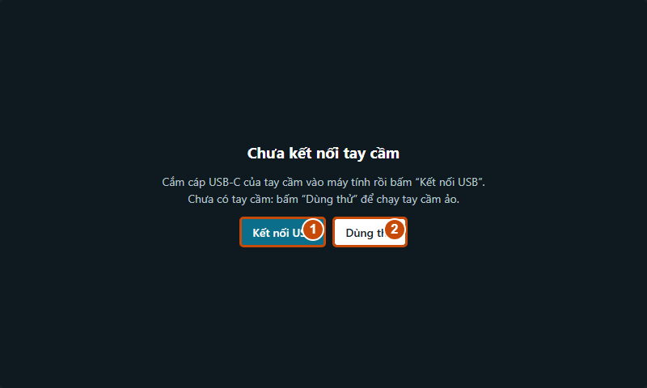

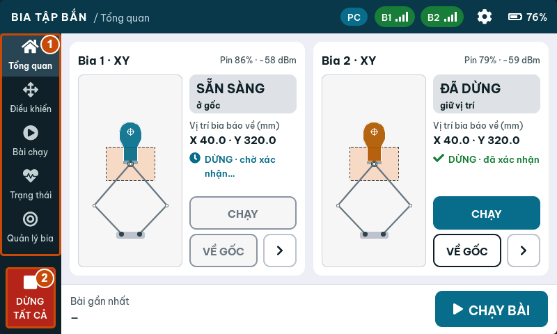

### 2.4. Quy trình ngắn cho lần sử dụng đầu

**Mở web → nối USB → ghép bia → tạo bài → xem chạy thử → lưu vào tay cầm → chọn bài trên tay cầm → chạy chậm → dừng → sao lưu.**

Nếu chưa có thiết bị, thay bước nối USB bằng Dùng thử. Nếu đã ghép bia từ trước, kiểm tra bia hiện trực tuyến rồi tiếp tục.

## 3. Kết nối website với tay cầm qua USB

### 3.1. Kết nối từng bước

1. Dừng các bia trước khi mở cổng USB. Một số driver CH340 có thể làm tay cầm khởi động lại lúc mở cổng.
2. Cắm cáp USB-C từ **tay cầm** vào máy tính. Không chọn nhầm cổng USB của bia.
3. Mở website bằng Chrome hoặc Edge. Bấm **Kết nối USB**.
4. Trong cửa sổ chọn thiết bị của trình duyệt, chọn cổng tay cầm; thường có tên **USB-SERIAL CH340**. Bấm nút kết nối của cửa sổ đó.
5. Chờ trang nhận trạng thái và hiện bản sao màn hình. Kiểm tra chỉ báo kết nối ở đầu trang.
6. Trên tay cầm thật, chip **PC** cho biết đang có máy tính kết nối.

Website tự thiết lập tốc độ cổng 921600 baud. Người dùng không cần nhập tốc độ này trong giao diện Studio.

### 3.2. Kết quả cần thấy

Bản sao màn hình hiển thị cùng trạng thái với tay cầm thật. Danh sách **Trên tay cầm** trong Thiết kế bài tập được tải về. Có thể mở một bài có sẵn và xem các điểm. Chỉ thử lệnh chuyển động sau khi đã kiểm tra bia và vùng chạy.

Nếu màn hình chưa cập nhật, chờ tay cầm khởi động xong. Nếu vẫn không có trạng thái, bấm **Ngắt**, đóng chương trình đang giữ cổng và kết nối lại. Xem bảng lỗi ở Chương 11.

### 3.3. Dùng bộ file cục bộ

Có thể mở `studio.html` từ thư mục máy tính khi thư mục chứa đủ `hmi_demo.js`, `hmi_remote.js` và các file hướng dẫn đi kèm. USB và mô phỏng sử dụng bộ file đó; lần tải website từ Internet vẫn cần mạng. Đăng nhập Google/cloud cần bản web trực tuyến được cấu hình đúng, không dùng bản mở từ ổ đĩa để đăng nhập.

### 3.4. Kết thúc kết nối

1. Bấm **DỪNG BÀI** hoặc **DỪNG TẤT CẢ** nếu muốn kết thúc chuyển động.
2. Kiểm tra bia đã dừng và lưu các bài đang sửa.
3. Bấm **Ngắt**, rồi rút cáp nếu không còn dùng máy tính.

**Ngắt USB hoặc đóng trang không phải lệnh dừng bia.** Tay cầm tiếp tục vận hành độc lập. Muốn dùng tay cầm khi không có máy tính, nạp bài xong, ngắt USB và thao tác trực tiếp trên màn hình tay cầm.

## 4. Ghép và quản lý bia

### 4.1. Ghép một bia mới

1. Bật tay cầm và bia cần ghép. Đặt cùng kênh ESP-NOW; kênh mặc định trong cấu hình hiện tại là 1.
2. Trên màn hình tay cầm, mở **Quản lý bia**. Có thể thao tác trên thiết bị thật hoặc bản sao trong tab Tay cầm khi đã nối USB.
3. Bấm **TÌM BIA MỚI** và chờ danh sách bia chưa ghép xuất hiện.
4. Chọn **Nhận diện** để kiểm tra đúng bia; thao tác này làm đầu mục tiêu chuyển động nhận diện.
5. Bấm **GHÉP** ở đúng dòng bia, sau đó **XONG**.
6. Chọn bia vừa thêm, kiểm tra tên, MAC, trạng thái và kênh. Đổi tên thành tên dễ nhận biết, ví dụ “Bia trái”.

Tay cầm hỗ trợ tối đa **8 bia**. Danh sách đã ghép lưu trong tay cầm và được giữ sau khi tắt nguồn.

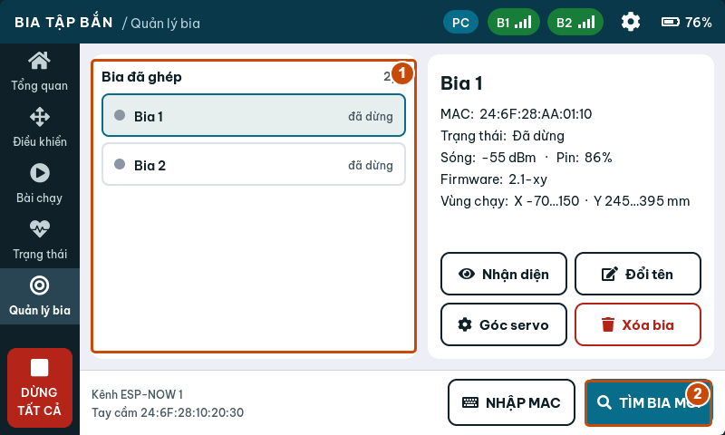

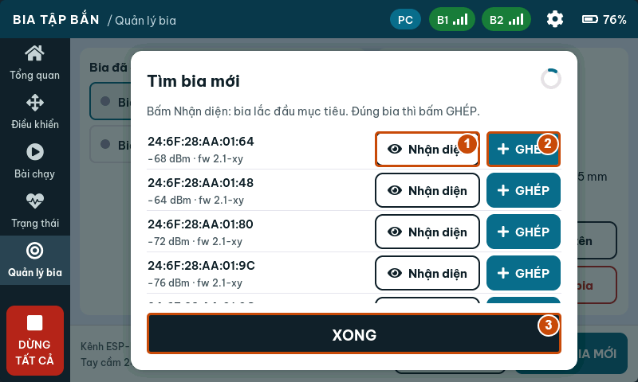

### 4.2. Ghép bằng địa chỉ MAC

Nếu đã biết MAC của bia, bấm **NHẬP MAC** trong Quản lý bia và nhập địa chỉ của đúng thiết bị. Bật bia, đặt cùng kênh và chờ hoàn thành ghép. Lấy MAC từ thông tin được bàn giao hoặc log USB của bia; không nhập MAC của tay cầm hay địa chỉ thiết bị khác.

### 4.3. Kiểm tra bia trước khi chạy

Chọn bia và kiểm tra **Trạng thái**, tín hiệu sóng, vị trí, phiên bản firmware và vùng chạy được báo về. Vào **Trạng thái** khi cần xem thêm thông tin. Bia mất kết nối hoặc báo lỗi chưa đủ điều kiện để bắt đầu bài.

Độ mạnh tín hiệu giúp nhận biết chất lượng đường truyền, nhưng không xác nhận cơ cấu đã lắp đúng. Vị trí trên màn hình là dữ liệu bia báo về; hệ thống hiện không dùng cảm biến độc lập để xác nhận vị trí cơ khí.

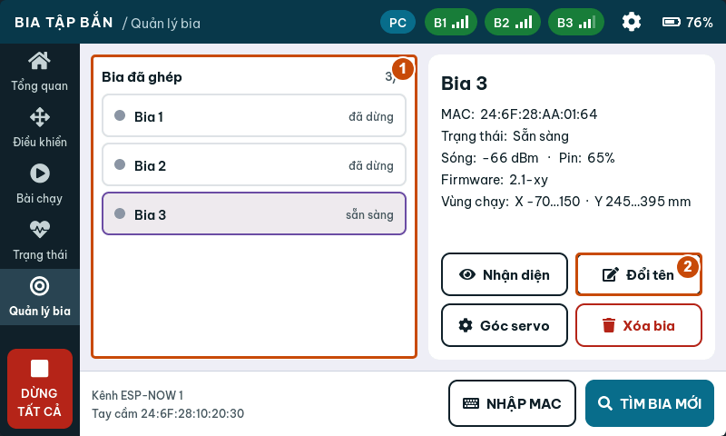

### 4.4. Đổi tên, xóa và chuyển tay cầm

**Đổi tên** sửa tên hiển thị của bia trong danh sách. **Xóa bia** bỏ ghép bia khỏi tay cầm; dừng bia trước khi xóa. Nếu cần chuyển bia sang tay cầm khác, kiểm tra trạng thái ghép ở cả hai thiết bị và dùng chức năng **Bo ghep** trên trang WiFi của bia khi cần gỡ liên kết cũ. Sau đó thực hiện quy trình tìm và ghép mới.

Không xóa bia chỉ để xử lý một lần mất sóng. Trước hết kiểm tra nguồn, kênh và khoảng cách.

## 5. Tạo bài tập trên website

### 5.1. Bắt đầu một bài mới

1. Mở **Thiết kế bài tập**, bấm **+ Bài mới**.
2. Nhập tên ngắn, ví dụ **Ngang 3 diem**. Tên tiếng Việt có dấu được hỗ trợ nhưng phải vừa giới hạn bộ nhớ; nếu trang báo tên quá dài, rút ngắn tên.
3. Chọn kiểu **Qua lại** hoặc **Lặp vòng** cho bài có danh sách điểm.
4. Thêm điểm bằng khung vẽ hoặc dùng **Tạo nhanh…**.

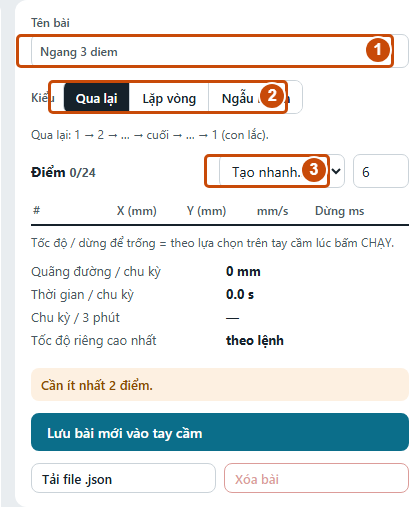

### 5.2. Hiểu các kiểu bài

| Kiểu | Cách di chuyển |
|---|---|
| Qua lại | Đi lần lượt từ điểm đầu đến điểm cuối, rồi trở ngược qua các điểm |
| Lặp vòng | Đi từ điểm đầu đến điểm cuối, rồi nối về điểm đầu và lặp |
| Ngẫu nhiên | Bia tự chọn điểm trong vùng chạy; không dùng danh sách điểm cố định |

Phân biệt **kiểu Ngẫu nhiên** với **Tạo nhanh → Ngẫu nhiên**: Tạo nhanh tạo một danh sách tọa độ ngẫu nhiên để tiếp tục sửa; kiểu Ngẫu nhiên để bia tự sinh điểm khi vận hành. Bài kiểu Ngẫu nhiên có sẵn trên tay cầm và không lưu lên Bài của tôi qua luồng hiện tại.

### 5.3. Thêm và sửa điểm

| Thao tác | Kết quả |
|---|---|
| Bấm vùng trống trong vùng hợp lệ | Thêm một điểm cuối bài |
| Bấm một điểm | Chọn điểm đó |
| Kéo điểm | Đổi tọa độ |
| Shift + bấm lên đường nối | Chèn điểm vào đoạn đang chọn |
| Delete | Xóa điểm đang chọn khi không gõ trong ô nhập |
| Phím mũi tên | Dịch điểm đang chọn 1 mm; giữ Shift để dịch 10 mm |
| Nút ↑ / ↓ trong bảng điểm | Đổi thứ tự điểm |
| Nút ✕ trong bảng điểm | Xóa điểm của dòng đó |

**Bắt lưới 5 mm** giúp đặt điểm dễ hơn. Bảng bên phải cho phép nhập chính xác X, Y bằng mm. Trục X biểu diễn trái/phải trong hệ tọa độ cơ cấu; Y tăng theo chiều lên trên khung vẽ. Đối chiếu hướng thực tế trong lần chạy chậm đầu tiên.

Vùng tô màu và viền trên khung vẽ cho biết vùng đặt điểm được bộ thiết kế chấp nhận. Điểm ngoài vùng, vượt góc servo hoặc gần cấu hình cơ cấu không phù hợp bị báo lỗi. Với bài có đoạn dài, quan sát toàn bộ đường nối giữa các điểm; các điểm hợp lệ riêng lẻ không thay thế kiểm tra đường chuyển động trên bia thực tế.

### 5.4. Tốc độ và thời gian dừng

Mỗi dòng điểm có **mm/s** và **Dừng ms**:

- Nhập tốc độ riêng trong khoảng 5–400 mm/s, hoặc để trống để dùng tốc độ của lệnh CHẠY.
- Nhập thời gian dừng từ 0 đến 60000 ms. Ví dụ 1000 ms = 1 giây; nhập 0 nghĩa là không dừng tại điểm.
- Để trống thời gian dừng để dùng thời gian dừng của lệnh chạy. “Trống” và “0” có ý nghĩa khác nhau.

Tốc độ của một điểm áp dụng cho đoạn đi **đến điểm đó**. Trần **Tốc độ tối đa** trong Cài đặt tay cầm giới hạn cả tốc độ chung và tốc độ riêng từng điểm. Nếu soạn 200 mm/s nhưng trần đang là 120 mm/s, lệnh gửi đến bia bị giới hạn ở 120 mm/s.

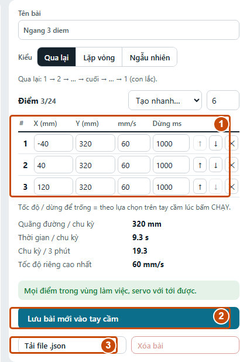

### 5.5. Tạo nhanh

Chọn số điểm ở cạnh ô **Tạo nhanh…**, rồi chọn Đường ngang, Đường dọc, Vòng tròn, Zích zắc, Hình chữ nhật hoặc Ngẫu nhiên. Kiểm tra các điểm vừa tạo và chỉnh tiếp trong bảng.

Một bài chứa tối đa **24 điểm**. Với hình vòng tròn hoặc hình chữ nhật, chọn **Lặp vòng** nếu muốn đường chuyển động khép kín. Đọc thông báo kiểm tra dưới bảng điểm trước khi lưu.

### 5.6. Xem chạy thử

1. Chọn **Tốc độ lệnh** và **Dừng mỗi điểm** dưới khung vẽ.
2. Bấm **▶ Xem chạy thử**. Quan sát điểm chuyển động và hình cơ cấu bên dưới.
3. Kiểm tra thứ tự điểm, đoạn nối, chiều đi và nhịp dừng.
4. Bấm lại nút chạy thử để dừng mô phỏng, sửa bài rồi xem lại.

Xem chạy thử là mô phỏng trong trình duyệt, không gửi lệnh làm bia thật chạy. Thời gian chu kỳ hiển thị là ước tính theo tọa độ, tốc độ và dừng; chưa tính đầy đủ tải cơ khí, sai lệch lắp ráp và điều kiện truyền lệnh. Tốc độ/dừng chọn để xem thử không tự thay đổi cài đặt chạy thật trên tay cầm.

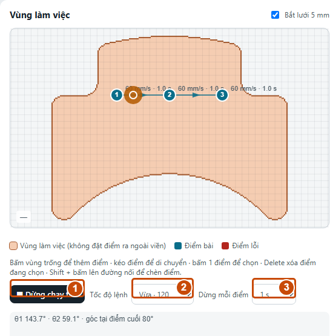

### 5.7. Chọn nơi lưu đúng

| Tình huống | Nút và nơi lưu |
|---|---|
| Bài mới, chưa đăng nhập, đã nối USB | Lưu bài mới vào tay cầm |
| Bài mới, đã đăng nhập Google | Lưu vào Bài của tôi trên cloud |
| Đang sửa bài Trên tay cầm | Lưu vào tay cầm để cập nhật bài đó |
| Đang sửa bài Bài của tôi | Lưu để cập nhật bản cloud |
| Bài cloud cần dùng trên thiết bị | Gửi xuống tay cầm (USB) để thêm một bản vào tay cầm |
| Bài tay cầm cần đưa lên tài khoản | Chép vào Bài của tôi |

**Trang không tự lưu mọi thao tác chỉnh sửa.** Bấm nút Lưu phù hợp và chờ thông báo thành công. Nếu đang dùng Dùng thử, “tay cầm” trong các nút lưu là tay cầm ảo.

Tay cầm có tổng cộng 32 chỗ bài: **6 bài có sẵn + tối đa 26 bài tự tạo**. Bài có sẵn được bảo vệ. Muốn sửa, chọn bài và bấm **Nhân bản để sửa**, đặt lại tên ngắn rồi lưu bản mới. Gửi một bài cloud nhiều lần bằng USB tạo thêm bản mới, nên kiểm tra danh sách trước khi gửi lại.

## 6. Ba bài mẫu thực hành

Các tọa độ dưới đây dành cho hình học mặc định 80/180/250 mm trong bộ thiết kế hiện tại. Kiểm tra thông báo hợp lệ của website và vùng chạy của bia thực tế trước khi dùng. Lần đầu chạy ở 60 mm/s với một bia và thời gian ngắn.

### 6.1. Bài “Ngang 3 diem”

Chọn **Qua lại** và nhập ba điểm:

| Điểm | X (mm) | Y (mm) | Tốc độ (mm/s) | Dừng (ms) |
|---|---|---|---|---|
| 1 | -40 | 320 | 60 | 1000 |
| 2 | 40 | 320 | 60 | 1000 |
| 3 | 120 | 320 | 60 | 1000 |

Bài đi 1 → 2 → 3 → 2 → 1 và tiếp tục lặp. Dùng bài này để kiểm tra chiều X và sự khác nhau giữa chuyển động với dừng tại điểm. File `bai-mau-ngang-3-diem.json` được cung cấp cùng sổ tay để nhập trực tiếp.

### 6.2. Bài “Doc 3 diem”

Chọn **Qua lại**:

| Điểm | X (mm) | Y (mm) | Tốc độ (mm/s) | Dừng (ms) |
|---|---|---|---|---|
| 1 | 40 | 270 | 60 | 1000 |
| 2 | 40 | 320 | 60 | 1000 |
| 3 | 40 | 370 | 60 | 1000 |

Bài dùng để kiểm tra chiều Y. Không thay đổi hiệu chuẩn chỉ vì hình vẽ chưa khớp hướng nhìn; đối chiếu hệ tọa độ cơ cấu và các thông số được bàn giao trước.

### 6.3. Bài “Chu nhat”

Chọn **Lặp vòng**:

| Điểm | X (mm) | Y (mm) | Tốc độ (mm/s) | Dừng (ms) |
|---|---|---|---|---|
| 1 | -20 | 280 | 60 | 500 |
| 2 | 100 | 280 | 60 | 500 |
| 3 | 100 | 360 | 60 | 500 |
| 4 | -20 | 360 | 60 | 500 |

Kiểm tra cả đoạn 4 → 1 khi xem mô phỏng. Khi bài hoạt động đúng, có thể nhân bản, đổi tên rồi điều chỉnh nhịp dừng hoặc tốc độ trong giới hạn cấu hình thiết bị.

## 7. Điều khiển và chạy bài trên bia

### 7.1. Điều khiển một bia

1. Mở **Tay cầm → Điều khiển** và chọn đúng tên bia.
2. Chọn **Kịch bản**, chọn bài đã lưu và tốc độ Chậm 60, Vừa 120 hoặc Nhanh 200 mm/s.
3. Kiểm tra bia trực tuyến, không báo lỗi và người vận hành thấy được vùng chạy.
4. Bấm **CHẠY**, xác nhận nếu hộp hỏi lại đang bật. Kiểm tra ô lệnh cuối và trạng thái bia.
5. Bấm **DỪNG** để dừng bia đang chọn; dùng **DỪNG TẤT CẢ** khi cần kết thúc toàn bộ hoạt động.

Chế độ **Ngẫu nhiên** để bia tự chọn điểm trong vùng chạy. Chọn thời gian dừng trước khi chạy; chế độ này chạy đến khi bấm dừng.

Chế độ **Chỉnh tay** dùng các nút hướng với bước 1, 5 hoặc 10 mm. Chạm vị trí hợp lệ trên hình cơ cấu để đặt đích; làm theo nút **ĐI TỚI** khi giao diện hiện đích cần gửi. Bắt đầu với bước nhỏ và kiểm tra vị trí báo về sau mỗi lệnh.

**Về gốc** đưa bia về vị trí gốc cấu hình của cơ cấu, không phải đưa X và Y về 0. Chỉ thực hiện khi vùng chuyển động đã thông thoáng.

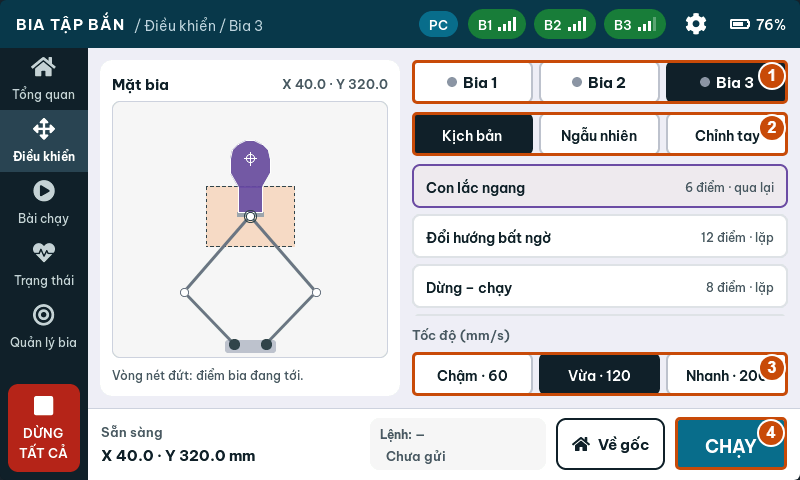

### 7.2. Chạy một phiên bài có thời gian

1. Mở **Tay cầm → Bài chạy**.
2. Chọn bài trong danh sách.
3. Chọn các **Bia tham gia** đang trực tuyến và không báo lỗi.
4. Chọn cách phối hợp, tốc độ và thời gian 1 phút, 3 phút, 5 phút hoặc Liên tục.
5. Đọc dòng **Sẽ chạy** để kiểm tra cấu hình cuối cùng.
6. Bấm **BẮT ĐẦU** và xác nhận nếu được yêu cầu.
7. Quan sát từng bia, thời gian đã chạy, điểm hiện tại và trạng thái.

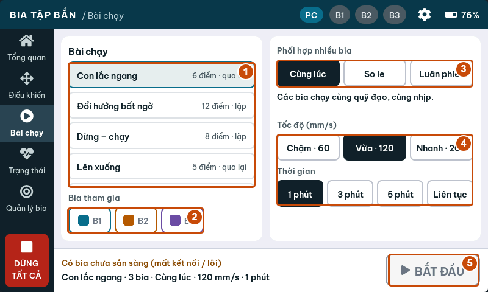

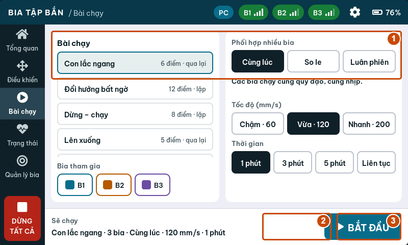

**TẠM DỪNG** tạm ngưng phiên; nút đổi thành **TIẾP TỤC** để chạy tiếp. **DỪNG BÀI** kết thúc phiên. Khi hết thời gian hoặc đã dừng, bấm **XONG · VỀ CHỌN BÀI** để quay lại màn chọn.

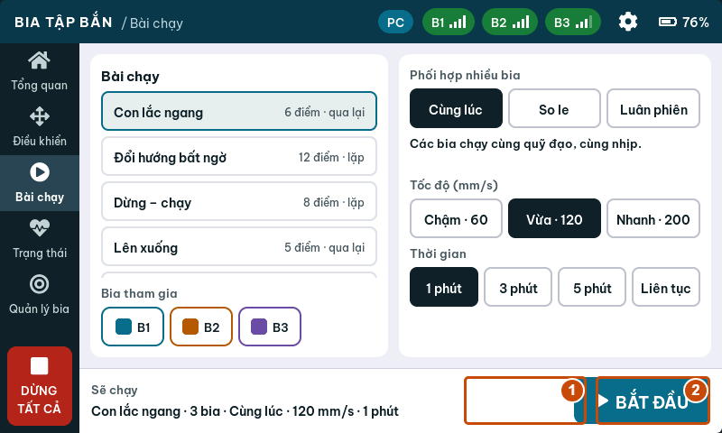

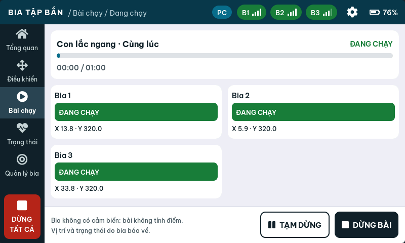

### 7.3. Phối hợp nhiều bia

| Chế độ | Hành vi được thiết kế |
|---|---|
| Cùng lúc | Các bia nhận cùng bài và chạy cùng nhịp |
| So le | Bia chẵn lệch nửa chu kỳ theo cấu hình phối hợp |
| Luân phiên | Mỗi lúc một bia chạy, các bia khác chờ; đổi lượt sau 6 giây |

Cùng lúc mô tả cách gửi và chạy bài; không phải cam kết các cơ cấu thực luôn trùng vị trí tuyệt đối theo thời gian. Thử từng bia riêng trước khi chạy nhóm.

### 7.4. Đọc phản hồi và dừng đúng

**Đã xác nhận** cho biết lệnh được phía bia xác nhận. **Chờ xác nhận…** nghĩa là đang chờ phản hồi. **Không phản hồi**, **MẤT KẾT NỐI** hoặc **LỖI** cần kiểm tra nguồn, sóng và cơ cấu.

Khi có bất thường, bấm **DỪNG TẤT CẢ**, quan sát chuyển động thực tế và dùng biện pháp dừng nguồn phù hợp với thiết bị nếu đường điều khiển không còn hoạt động. Kiểm tra nguyên nhân trước khi dùng **ĐẶT LẠI** ở Điều khiển. Chỉ bấm chạy lại sau khi bia trực tuyến và lỗi đã được xử lý.

## 8. Tài khoản, cloud và đồng bộ

### 8.1. Lưu Bài của tôi

1. Mở bản website trực tuyến có Internet.
2. Bấm **Đăng nhập Google** và chọn tài khoản.
3. Mở Thiết kế bài tập, tạo bài có điểm và bấm **Lưu vào Bài của tôi**.
4. Kiểm tra bài xuất hiện dưới Bài của tôi. Đợi thông báo lưu thành công trước khi đóng trang.
5. Muốn dùng bài trên thiết bị hiện tại, nối USB, mở bài cloud và bấm **Gửi xuống tay cầm (USB)**.

Không cần tay cầm để soạn và lưu một bài cloud. Cần Internet và dịch vụ đăng nhập/lưu trữ đang hoạt động. Nếu không đăng nhập được, vẫn có thể dùng USB, mô phỏng và JSON.

### 8.2. Trạng thái hỗ trợ của đồng bộ WiFi

**Firmware tay cầm đối chiếu ngày 03/10/2026 chưa có mục cấu hình WiFi Internet, tạo mã 6 số hoặc tải bài cloud.** Vì vậy không có bước trên tay cầm hiện tại để hoàn thành ghép cloud. Dùng USB để chuyển bài; việc chọn danh sách trên website chưa chứng minh thiết bị đã nhận bài.

Chỉ dùng quy trình sau với bản firmware được bàn giao có đầy đủ hỗ trợ cloud:

1. Kết nối tay cầm với WiFi có Internet theo tài liệu của firmware đó.
2. Mở chức năng ghép cloud trên tay cầm để lấy mã 6 số.
3. Trên web, đăng nhập và mở **Đồng bộ**. Nhập mã, đặt tên tay cầm, bấm **Ghép đôi**. Mã theo thiết kế server dùng được trong 15 phút.
4. Chọn tay cầm, tick tối đa 26 bài trong **Bài nạp xuống tay cầm này**.
5. Dùng ↑ / ↓ để xếp thứ tự, rồi bấm **Lưu danh sách**.
6. Chờ thiết bị đồng bộ; đối chiếu mốc đồng bộ và mở danh sách bài trên chính tay cầm để xác nhận đã nhận đúng bài.

Theo thiết kế của màn hình Đồng bộ, lần đồng bộ sẽ **thay các bài tự tạo trên tay cầm bằng danh sách được chọn**. Sao lưu bài trên tay cầm trước khi dùng firmware có tính năng này. Nút Lưu danh sách chỉ lưu lựa chọn lên cloud, không phải thao tác chạy bia.

### 8.3. Gỡ tay cầm và đăng xuất

**Gỡ tay cầm** trong Đồng bộ gỡ liên kết trên tài khoản cloud, khác với Xóa bia ở Quản lý bia. **Đăng xuất** kết thúc phiên tài khoản trên website. Bài đã nạp bằng USB vào tay cầm vẫn là dữ liệu cục bộ của thiết bị.

## 9. Sao lưu và chuyển bài bằng file

### 9.1. Xuất một bài

Mở bài và bấm **Tải file .json**. Lưu vào thư mục có ngày hoặc tên phiên bản, ví dụ `Bai_tap/2026-10-03/`. File chứa tên, kiểu bài, tọa độ, tốc độ và thời gian dừng. Có thể xuất nội dung đang sửa; muốn nội dung đó có trên tay cầm/cloud vẫn phải bấm Lưu riêng.

### 9.2. Xuất nhiều bài

Nút **Xuất file** ở cột danh sách xuất Bài của tôi nếu đã đăng nhập và thư viện cloud có bài. Nếu không rơi vào trường hợp đó, trang lấy các bài tự tạo từ tay cầm đang kết nối. Bài có sẵn không nằm trong bản xuất danh sách bài tự tạo.

Muốn sao lưu tay cầm trong lúc tài khoản cloud cũng có bài, xuất từng bài Trên tay cầm hoặc đăng xuất rồi dùng Xuất file. Mở file để kiểm tra có đúng số lượng và tên bài cần sao lưu.

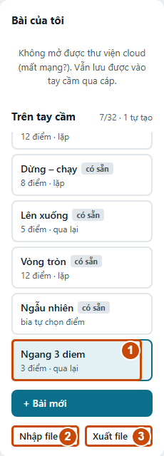

### 9.3. Nhập lại

1. Bấm **Nhập file…**, chọn file JSON đã xuất.
2. Nếu file chứa một bài, trang mở bài để sửa; kiểm tra điểm rồi bấm **Lưu** để giữ lại.
3. Nếu file chứa nhiều bài, đăng nhập hoặc kết nối tay cầm trước. Đọc hộp xác nhận nơi nhập: Bài của tôi khi đã đăng nhập, tay cầm khi chưa đăng nhập.
4. Kiểm tra thông báo số bài nhập thành công và danh sách kết quả. Mỗi bài được thêm thành bài mới, phụ thuộc số chỗ còn trống.

Nhập JSON không tự làm bia chạy. File bài tập không phải bản sao toàn bộ thiết bị: không chứa danh sách ghép bia, cài đặt tay cầm hoặc hiệu chuẩn servo của bia.

### 9.4. Chuyển sang tay cầm khác

Xuất bài từ tay cầm nguồn, ngắt USB, nối tay cầm đích rồi nhập và lưu bài. Ghép bia và kiểm tra vùng chạy của tay cầm đích riêng. Chạy thử chậm trước khi dùng bài trên bộ cơ cấu khác.

## 10. Cài đặt và hiệu chuẩn

### 10.1. Cài đặt tay cầm

Mở biểu tượng bánh răng trên màn hình tay cầm. Các thay đổi áp dụng ngay và được lưu trong thiết bị.

| Mục | Nội dung cần biết |
|---|---|
| Màn hình | Độ sáng và thời gian tự giảm sáng; lần chạm để sáng lại không bấm nút bên dưới |
| Kết nối | Kênh ESP-NOW, thời gian báo mất kết nối và công suất phát |
| An toàn | Hỏi lại trước khi CHẠY, trần tốc độ gửi đến bia |
| Mặc định | Tốc độ, thời gian bài, bước chỉnh tay và thời gian dừng mặc định |
| Thông tin | Thông tin tay cầm và chức năng khởi động lại |

Thời gian **Báo mất kết nối sau** trên tay cầm là thời gian đổi chỉ báo giao diện. Thời gian tự dừng khi mất liên lạc thuộc cài đặt/giao thức phía bia; không coi hai thông số là một.

Khi cần đổi kênh, dừng bài trước, ghi kênh cũ, đổi và kiểm tra lại từng bia. Bia bị tắt nguồn trong lúc đổi kênh có thể cần điều chỉnh lại qua trang cấu hình. Dùng **KHÔI PHỤC MẶC ĐỊNH** sau khi đã ghi lại cấu hình cần giữ; đây không phải quy trình sửa lỗi ghép mặc định.

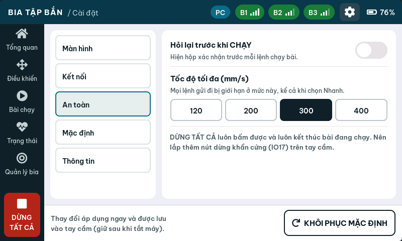

### 10.2. Mở trang WiFi riêng của bia

1. Dừng hoạt động và chọn đúng bia cần cấu hình.
2. Tìm mạng **BIA_TAP_BAN_xxxx** trên máy tính hoặc điện thoại.
3. Nhập mật khẩu riêng của bia được bàn giao. Firmware sinh mật khẩu riêng dài 10 ký tự và giữ trong bộ nhớ; không có mật khẩu chung cho mọi bia.
4. Nếu chưa có thông tin, người phụ trách kỹ thuật nối USB vào bia và xem dòng log `[AP]` để lấy SSID, mật khẩu và IP. Không nhầm với cổng USB tay cầm.
5. Giữ kết nối mạng của bia kể cả khi hệ điều hành báo không có Internet. Mở địa chỉ IP của bia bằng HTTP; địa chỉ mặc định thường là `http://192.168.4.1`, dùng IP in trong log nếu khác.

Bia cho tối đa **một máy truy cập WiFi cùng lúc** theo cấu hình hiện tại. Mạng này phục vụ trang cục bộ, không cấp Internet và không phải đường đồng bộ Bài của tôi.

### 10.3. Dùng trang cấu hình của bia

Trang cục bộ có các nút **STOP**, **VE GIUA**, **CHAY**, phần Kịch bản, phần hiệu chuẩn servo và phần ESP-NOW. Nhãn hiện dùng tiếng Việt không dấu. Nếu bia đang thuộc quyền điều khiển của tay cầm, các thao tác web chuyển động/cấu hình có thể bị khóa với phản hồi `busy`; STOP vẫn được phép. Kết thúc hoạt động từ tay cầm trước khi chuyển sang cấu hình tại chỗ.

Để thử một danh sách điểm trên trang này, tạo/sửa Kịch bản, bấm **Nap vao bia**, kiểm tra và bấm **CHAY**. Danh sách này thuộc đường cấu hình của một bia; không tự thêm thành bài trong thư viện tay cầm hoặc Bài của tôi.

### 10.4. Góc servo và thông số hiệu chuẩn

Trong **Quản lý bia → Góc servo**, người phụ trách có thể chỉnh góc servo 1/2 bằng bước nhỏ và gửi để căn tay quay. Bia quay chậm đến góc gửi rồi giữ. Thao tác này đặt góc trực tiếp; không phải nút lưu offset hiệu chuẩn lâu dài.

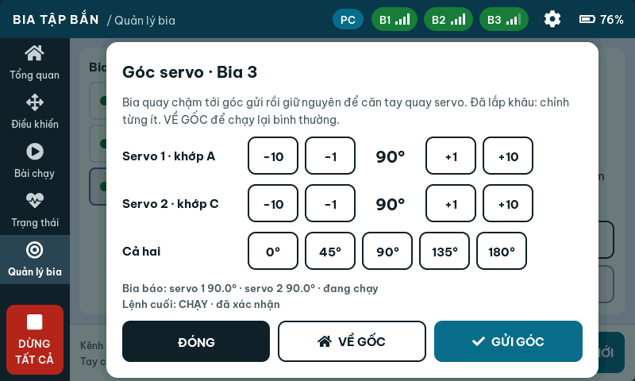

Trên trang WiFi của bia, các trường **Offset 1**, **Chieu 1**, **Offset 2**, **Chieu 2** xác định quan hệ góc cơ cấu và servo. **Ap dung** áp dụng thông số; **Luu vao may** lưu cấu hình của bia. Ghi lại thông số cũ trước khi sửa, chỉ thay từng thông số theo quy trình lắp ráp của bộ cơ cấu. Sau khi căn, dùng **VỀ GỐC/VE GIUA** và kiểm tra lại bằng bài chậm.

Không sao chép offset giữa hai bia chỉ vì hình dáng giống nhau. Nếu cơ cấu đã lắp đầy đủ, chỉnh góc từng ít và dừng ngay khi có dấu hiệu kẹt. Ngắt nguồn trước khi can thiệp tay vào khâu hoặc dây dẫn.

### 10.5. Cập nhật firmware tay cầm và bia qua USB

Tab **Cập nhật** chỉ nạp được khi bộ web có bản phát hành cho thiết bị. Nếu hiện “Chưa có bản phần mềm trên web”, chưa có gói để nạp; liên hệ người bàn giao để nhận đúng bản. Tab này không tự bổ sung khả năng cloud khi chưa có firmware tương ứng.

1. Dùng **Chrome hoặc Edge trên máy tính**, mở Studio từ website HTTPS được bàn giao và giữ kết nối Internet để tải firmware. Nếu đang mở file HTML trực tiếp và thấy “Mở Studio từ link web để cập nhật phần mềm”, chuyển sang website.
2. Sao lưu các bài cần giữ ra JSON, ghi lại kênh ESP-NOW và thông số hiệu chuẩn; bấm **DỪNG TẤT CẢ**, quan sát bia dừng và kết thúc phiên điều khiển.
3. Mở tab **Cập nhật**, chọn **Tay cầm** hoặc **Bia** theo thiết bị thực tế và đọc **Bản mới nhất**. Cập nhật từng thiết bị; nạp tay cầm không tự cập nhật các bia đã ghép.
4. Cắm cáp USB **truyền dữ liệu vào chính thiết bị cần nạp**: cập nhật tay cầm thì cắm vào tay cầm, cập nhật bia thì cắm trực tiếp vào bia. Không cần bấm **Kết nối USB** ở đầu trang. Đóng Serial Monitor, chương trình nạp và tab khác đang giữ cổng.
5. Bấm **Nạp phần mềm**, chọn đúng cổng (tay cầm thường là **USB-SERIAL CH340**). Nếu Studio đang giữ cổng tay cầm, bấm **Ngắt và tiếp tục** để dành cổng cho việc nạp. Khi được hỏi “Đây có phải bia không?”, chỉ xác nhận nếu cáp thực sự nối vào bia; nếu chọn nhầm, hủy và chọn lại đúng thiết bị.
6. Chờ thanh tiến độ hoàn tất và trạng thái **Xong**, thiết bị tự khởi động lại. Giữ nguồn ổn định, không rút cáp, đóng trang hoặc tắt nguồn khi đang nạp. Chỉ thấy thanh tiến độ 100% chưa đủ nếu trạng thái vẫn báo lỗi.
7. Với tay cầm, bấm **Kết nối USB** lại và kiểm tra phiên bản trong **Cài đặt → Thông tin**. Kiểm tra danh sách bia, bài tập, kênh và cài đặt; với bia, kiểm tra lại kết nối và thông số hiệu chuẩn. Thử một bài chậm trước khi vận hành. Lặp lại quy trình cho từng bia cần cập nhật.

Nếu nạp nhanh bị lỗi, thử **Nạp chậm**. Nếu không vào chế độ nạp, làm theo chỉ dẫn BOOT trên màn hình và tài liệu của board. Không xác nhận tiếp khi thiết bị thực tế khác loại đang chọn. Cơ chế nạp hiện dùng `eraseAll: false`; vẫn cần sao lưu và kiểm tra dữ liệu sau khi cập nhật, đặc biệt khi đổi cấu trúc bộ nhớ hoặc phiên bản lớn.

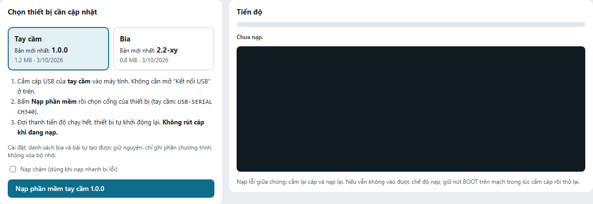

## 11. Xử lý sự cố

| Hiện tượng | Kiểm tra và cách xử lý |
|---|---|
| Không có nút/cổng USB dùng được | Dùng Chrome/Edge trên máy tính, mở bản HTTPS hoặc bộ file cục bộ phù hợp; kiểm tra hỗ trợ Web Serial |
| Không thấy USB-SERIAL CH340 | Thay cáp truyền dữ liệu, đổi cổng USB; kiểm tra driver của board trong quản lý thiết bị |
| Cổng đang bận | Đóng Serial Monitor, chương trình nạp và tab Studio khác đang giữ cùng cổng |
| Tay cầm khởi động lại khi kết nối | Chờ khởi động xong rồi nhận trạng thái; luôn nối USB lúc bia đã dừng |
| Màn hình không hiện, báo thiếu hmi_demo.js hoặc hmi_remote.js | Dùng bộ file đầy đủ và đặt các file JS cạnh studio.html; bản trực tuyến cần tải được các tài nguyên này |
| Mất bài sau khi tải lại trang | Kiểm tra có đang dùng tay cầm ảo hoặc chưa bấm Lưu; phục hồi từ JSON/cloud nếu đã sao lưu |
| Không tìm thấy bia | Kiểm tra nguồn bia, kênh ESP-NOW và tình trạng đã ghép tay cầm khác; dùng MAC đúng khi cần |
| Bia báo MẤT KẾT NỐI / Không phản hồi | Dừng bài, kiểm tra nguồn, khoảng cách, kênh và vật cản; chỉ chạy lại khi nhận được trạng thái |
| Điểm đỏ hoặc không lưu được | Đọc thông báo dưới bảng; sửa tọa độ vào vùng hợp lệ, tốc độ 5–400, dừng không quá 60000 ms |
| Báo tên quá dài | Rút ngắn tên; tên có dấu chiếm nhiều byte UTF-8 hơn chữ ASCII |
| Nút sửa/xóa bài bị khóa | Có thể là bài có sẵn: dùng Nhân bản để sửa; hoặc chưa kết nối/chưa đăng nhập vào nơi lưu |
| Tay cầm hết chỗ bài | Sao lưu rồi xóa bớt bài tự tạo không dùng; giới hạn 26 bài tự tạo |
| Bài lưu rồi nhưng chưa có trên tay cầm | Kiểm tra nơi lưu; bài Bài của tôi cần Gửi xuống tay cầm (USB) ở firmware hiện tại |
| Bia chạy chậm hơn tốc độ đã soạn | Kiểm tra trần Tốc độ tối đa trên tay cầm và tốc độ riêng từng điểm |
| Nhập một bài rồi đóng trang bị mất | Nhập một bài chỉ mở vào bộ sửa; cần bấm Lưu hoặc tải file trước khi đóng |
| Xuất file không ra bài tay cầm | Đã đăng nhập và có bài cloud: nút xuất danh sách ưu tiên cloud; xuất từng bài tay cầm hoặc đăng xuất |
| Đăng nhập Google không mở được | Dùng bản web trực tuyến, kiểm tra Internet và cấu hình dịch vụ; dùng USB/JSON nếu cloud chưa hoạt động |
| Không có mã 6 số trên tay cầm | Firmware hiện tại chưa hỗ trợ cloud; dùng USB, không tìm mã trên trang WiFi của bia |
| Không vào được WiFi bia | Kiểm tra đúng SSID/mật khẩu, ngắt máy thứ hai, giữ mạng không Internet và mở IP đúng bằng HTTP |
| Trang WiFi bia báo busy | Bia đang được tay cầm điều khiển; dừng/kết thúc hoạt động rồi kiểm tra lại quyền điều khiển |
| Bia kẹt, rung hoặc báo lỗi cơ cấu | Dừng, kiểm tra lắp ráp và hiệu chuẩn; xử lý nguyên nhân rồi mới ĐẶT LẠI và thử chậm |

Khi cần hỗ trợ, ghi lại: thao tác vừa làm, tên bài, tên/MAC bia, phiên bản firmware, kênh, nơi lưu và thông báo lỗi. Tab Console giúp xem lệnh và phản hồi. Người dùng thông thường không cần gửi JSON thủ công; không thử các lệnh chuyển động chưa hiểu.

## 12. Phiếu kiểm tra, bàn giao và nhật ký

### 12.1. Trước mỗi phiên

- [ ] Nguồn tay cầm và bia ổn định.
- [ ] Cơ cấu, dây dẫn và vùng chuyển động đã kiểm tra.
- [ ] Đúng tên bia, đủ kết nối, không báo lỗi.
- [ ] Đúng bài, đúng bia tham gia, đúng thời gian và trần tốc độ.
- [ ] Đã xem mô phỏng khi bài vừa thay đổi.
- [ ] Đã thử chậm trên thiết bị và xác định nút dừng sử dụng được.

### 12.2. Sau mỗi phiên

- [ ] Đã dừng bài và quan sát bia dừng thực tế.
- [ ] Bài chỉnh sửa đã lưu thành công.
- [ ] Đã xuất JSON cho bài cần giữ.
- [ ] Đã ngắt USB và tắt nguồn theo quy trình bàn giao của bộ thiết bị.
- [ ] Ghi lại lỗi, hiệu chỉnh hoặc chi tiết cần bảo dưỡng.

### 12.3. Phiếu bàn giao thiết bị

| Thông tin | Ghi khi bàn giao |
|---|---|
| Người nhận / ngày | ________________________________________ |
| Tên tay cầm / phiên bản firmware | ________________________________________ |
| Kênh ESP-NOW | ________________________________________ |
| Tên và MAC các bia | ________________________________________ |
| SSID / cách nhận mật khẩu riêng | ________________________________________ |
| Trần tốc độ được kiểm tra | ________________________________________ |
| Thông số hiệu chuẩn và nguồn cấp | ________________________________________ |
| Nút dừng cứng đã lắp / chưa lắp | ________________________________________ |
| Nơi lưu file bài tập và bản tài liệu | ________________________________________ |

### 12.4. Nhật ký sử dụng

| Ngày | Bài / bia | Tốc độ / thời gian | Kết quả / lỗi | Người vận hành |
|---|---|---|---|---|
| __________ | __________ | __________ | __________ | __________ |
| __________ | __________ | __________ | __________ | __________ |
| __________ | __________ | __________ | __________ | __________ |
| __________ | __________ | __________ | __________ | __________ |

## Phụ lục A. Giới hạn và đơn vị

| Thông số | Giá trị trong phiên bản đối chiếu |
|---|---|
| Số bia trên một tay cầm | Tối đa 8 |
| Số bài trên tay cầm | 32, gồm 6 có sẵn và tối đa 26 tự tạo |
| Số điểm mỗi bài | Tối đa 24 |
| Tốc độ riêng một điểm | 5–400 mm/s; còn bị giới hạn bởi trần tay cầm |
| Tốc độ chung trên màn chọn | 60 / 120 / 200 mm/s |
| Trần tốc độ tay cầm | 120 / 200 / 300 / 400 mm/s |
| Dừng một điểm | 0–60000 ms; để trống để theo lệnh |
| Tên bài | Ô nhập tối đa 30 ký tự, dữ liệu tối đa 39 byte UTF-8 |
| Thời gian phiên | 1 / 3 / 5 phút hoặc Liên tục |
| Bước chỉnh tay | 1 / 5 / 10 mm |
| USB | 921600 baud, website tự thiết lập |
| Kênh ESP-NOW | 1–13, các thiết bị phải cùng kênh |
| Số máy vào WiFi của một bia | 1 |
| Mã ghép cloud theo thiết kế server | 6 số, thời hạn 15 phút; cần firmware hỗ trợ |

**mm** là milimét; **mm/s** là milimét mỗi giây; **ms** là mili giây. 1000 ms = 1 giây. Tọa độ dùng hệ cơ cấu, không phải khoảng cách giữa người dùng và bia.

## Phụ lục B. Thuật ngữ và file bài mẫu

**Bài tập:** tên, kiểu di chuyển và danh sách điểm cùng thông số. **Phiên bài:** lần chạy cụ thể, gồm bài, các bia tham gia, tốc độ, thời gian và cách phối hợp. **Cloud:** dữ liệu gắn với tài khoản trên Internet. **Flash:** bộ nhớ giữ dữ liệu sau khi tắt nguồn. **MAC:** địa chỉ nhận diện thiết bị khi ghép. **Hiệu chuẩn:** chỉnh quan hệ giữa cơ cấu thực và thông số điều khiển.

Một điểm trong JSON có dạng `[X, Y, tốc độ, dừng]`. Tốc độ `0` nghĩa là theo tốc độ lệnh; dừng `-1` nghĩa là theo thời gian dừng của lệnh. Người dùng có thể để trống hai ô tương ứng trên giao diện thay vì sửa các giá trị này bằng tay.

File `bai-mau-ngang-3-diem.json` đi kèm chứa bài Qua lại ba điểm với tốc độ 60 mm/s và dừng 1000 ms. Nhập file rồi kiểm tra trong bộ thiết kế trước khi lưu vào tay cầm.

Để in tài liệu: mở bản HTML và bấm **In / Lưu PDF**, chọn A4, tỉ lệ 100%; hoặc dùng bản PDF đi kèm. Bản DOCX dùng để thêm ảnh thiết bị thực tế, thông tin bàn giao và chỉnh bố cục trước khi đóng quyển. Kiểm tra lại trang xem trước và cập nhật số trang mục lục nếu tiếp tục biên tập trong Word.
